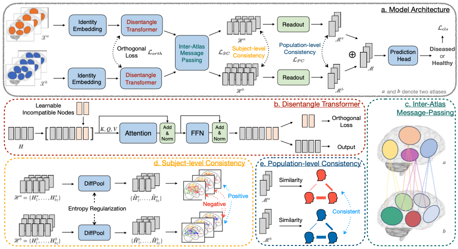

# AIDFusion

This is the official PyTorch implementation of AIDFusion from the paper 
*"Multi-Atlas Brain Network Classification through Consistency Distillation and Complementary Information Fusion"* published in IEEE Journal of Biomedical and Health Informatics (JBHI) 2025.

Link: [Paper](https://ieeexplore.ieee.org/abstract/document/11165071/).




## Data
All Preprocessed data used in this paper are published in [this paper](https://proceedings.neurips.cc/paper_files/paper/2023/file/44e3a3115ca26e5127851acd0cedd0d9-Paper-Datasets_and_Benchmarks.pdf). 
Data splits and configurations are stored in `./data/` and `./configs/`. If you want to process your own data, please check the dataloader script `./data/BrainNet.py`.

## Usage

Please check `experiment.sh` on how to run the project.

## Citation

If you find this code useful, please consider citing our paper:

```
@ARTICLE{11165071,
  author={Xu, Jiaxing and Lan, Mengcheng and Dong, Xia and He, Kai and Zhang, Wei and Bian, Qingtian and Ke, Yiping},
  journal={IEEE Journal of Biomedical and Health Informatics}, 
  title={Multi-Atlas Brain Network Classification through Consistency Distillation and Complementary Information Fusion}, 
  year={2025},
  volume={},
  number={},
  pages={1-12},
  keywords={Transformers;Functional magnetic resonance imaging;Brain modeling;Network analyzers;Training;Representation learning;Data mining;Information filters;Feature extraction;Bioinformatics;Brain Network;Multi-atlas Consistency;fMRI Biomarker;Brain Disorders;Graph Neural Network},
  doi={10.1109/JBHI.2025.3610111}}
```

## Contact

If you have any questions, please feel free to reach out at `jiaxing003@e.ntu.edu.sg`.
